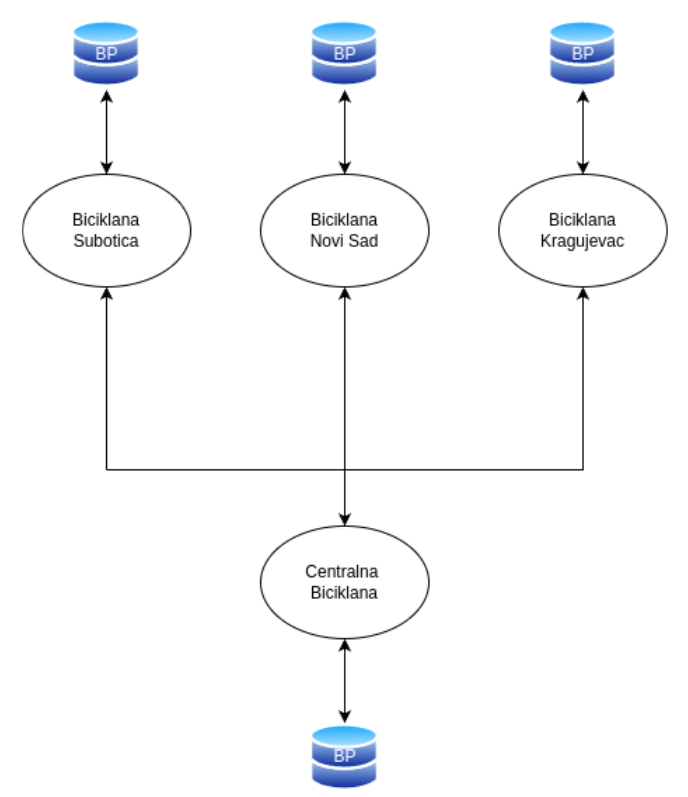

# Bike Rental System

A cloud-native bike rental system implemented as part of the *Cloud computing* course project.  
The system models three city bike rentals offices (**Subotica**, **Novi Sad**, **Kragujevac**) and one **Central Bike Service**, each running as its own service with its own database.

---

## Features

- **User registration** with centralised JMBG check  
- **Bike checkout / return** with per-user limits (max 2 active rentals)  
- **Local databases** per city for tracking which user has which bike  
- **Central database** for managing users and total active rentals  

---

## Architecture

| Component | Tech Stack | Description |
|-----------|------------|-------------|
| Bike office shop (Subotica / Novi Sad / Kragujevac) | C# (.NET) + PostgreSQL | Local services for renting and returning bikes |
| Central Bike Shop | C# (.NET) + PostgreSQL | Central authority for users & active rentals |
| Frontend | React + Vite + Nginx | Simple UI to use the system |
| Containerisation | Docker, GitHub Actions | Build and push images to Docker Hub as well as the local Docerfiles for all the apps |
| Orchestration | Minikube / Kubernetes | Each app + DB in its own Pod with Persistent Volume and Ingress |

<p align="center">
  
</p>

---

## Try the app

```bash
git clone https://github.com/ukinolo/bike-shop.git
cd bike-shop

# start the container app from dockerfiles
./start-compose

#start the app from dockerhub
./start-hub

#start the app in minikube cluster
cd kubernetes
/.start-minikube
/.start-app
```

## Focus on cloud native practices

Although the bike rental logic is simple, the main purpose of this project was to practise cloud technologies and modern DevOps practices:

 - Writing Dockerfiles for each service
 - Using docker-compose for local multi-container development
 - Publishing images to Docker Hub with GitHub Actions workflows
 - Running the complete system on a local Kubernetes (Minikube) cluster
 - Creating Persistent Volumes for stateful data
 - Exposing services securely through an Ingress gateway

## Author

**Name:** Uros Nikolovski <br>
**Index:** E2 38/2024